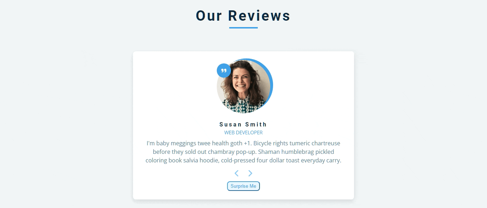

<div align="center">
<h1>Review cards</h1>
  
**_Tutorial project focusing on array and objects._**
  


  
[Features](#features)  • 
[Getting started](#getting-started)  •
[How to use](#how-to-use)  •
[Credits](#credits)


</div>

## Features
- Fully responsive (desktop and mobile)
- Ramdomness button
- Progressivity and retroactivity button

## Getting started
To begin to use this project, choose one of the following options:
- Clone the repo: `git clone https://github.com/pehmattos/reviews.git`
- Download on GitHub
- Fork the repo

Now open `index.html`. That's it!

## How to use
- Place an image in `img/`
- Create an item to add to menu. Follow this example: 

```js
// add in const review script.js

{
  id: 1,
  name: "susan smith",
  job: "web developer",
  img: "./img/person-1.jpg",
  text: "I'm baby meggings twee health goth +1. Bicycle rights tumeric chartreuse before they sold out chambray pop-up. 
  Shaman humblebrag pickled coloring book salvia hoodie, cold-pressed four dollar toast everyday carry.",
},
```

## Credits
- [FreeCodeCamp](https://www.freecodecamp.org/news/javascript-projects-for-beginners/)
- _John Smilga_ - [Github](https://github.com/john-smilga/javascript-basic-projects/tree/master/03-reviews) | [Website](https://www.johnsmilga.com/)
- Google Fonts
- Font Awesome


